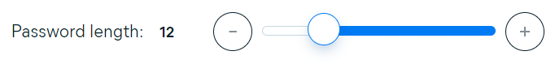

# Password Generator Web Application

[](https://www.w3.org/Style/CSS/Overview.en.html) [](https://html.com/)
[](https://www.javascript.com)
[](https://www.edx.org/)

## Table of content

- [Password Generator Web Application](#password-generator-web-application)
  - [Table of content](#table-of-content)
  - [Project Description](#project-description)
  - [Requirements](#requirements)
  - [Installation instructions](#installation-instructions)
    - [Option 1 - Download](#option-1---download)
    - [Option 2 - Clone project](#option-2---clone-project)
  - [Project structure](#project-structure)
  - [Demo](#demo)
  - [Features](#features)
    - [Checkbox](#checkbox)
    - [Range slider](#range-slider)
    - [Copy password button](#copy-password-button)
    - [Password score](#password-score)
    - [Information sections](#information-sections)
  - [Statistics](#statistics)
    - [Directories](#directories)
    - [Files](#files)
    - [Languages](#languages)
  - [Tools and extensions](#tools-and-extensions)
    - [Prettier](#prettier)
    - [VSCode](#vscode)
    - [VS Code Counter](#vs-code-counter)
  - [References](#references)
  - [License](#license)
    - [MIT](#mit)

## Project Description

This project focuses on creating a user-friendly web application that allows user to **generate secure and random passwords based on their specified criteria**. The application runs in the browser and dynamically updated **HTML** and **CSS**, powered by custom **JavaScript** code. The goal is to provide a polished and responsive user interface adaptable to various screen sizes.

## Requirements

Web application will:
1. Generate a password when the "Generate Password" button is clicked.
2. Prompt users for password criteria, including:
   - Length of password (between 8 and 128 characters).
   - Character types: Lowercase, Uppercase, Numeric, and Special characters.
3. Validate each input, ensuring at least one character type is selected.
4. Display the generated password in the page.

## Installation instructions

### Option 1 - Download

Download the project from GitHub [repository](https://github.com/FilipPaskalev/Password-generator.git) on your local machine.

1. Open GitHub repository. [(link to repository)](https://github.com/FilipPaskalev/Password-generator.git)

2. Select ```Code``` from top navigation section. (reference on the image below) 👇

    

5. Select ```<> Code``` dropdown button from sub section. (reference on the image below) 👇

    

8. Select ```Download ZIP``` from dropdown menu to download project in .zip format. (reference on the image below) 👇

    

11. Unzip the project. 

    > [!TIP]
    > You can use 7-Zip if you don't have file archiver. 
    >**7-Zip** is **free software** with **open source**. The most of the code is under the **GNU LGPL** license. Some parts of the code are under the BSD 3-clause License. Also there is unRAR license restriction for some parts of the code. Read [7-Zip License](https://www.7-zip.org/license.txt) information. 
    > Download the application from [official website](https://www.7-zip.org/).

13. Open project with VS Code or other IDE.

### Option 2 - Clone project

1. On GitHub.com, navigate to the main page of the repository. [(link to repository)](https://github.com/FilipPaskalev/Password-generator.git).

2. Above the list of files, click  Code. (reference on the image below) 👇

    

5. Copy the URL for the repository.
- To clone the repository using HTTPS, under "HTTPS", click <svg version="1.1" fill="#0F66B8" width="16" height="16" viewBox="0 0 16 16" aria-label="Copy to clipboard" role="img"><path d="M3.626 3.533a.249.249 0 0 0-.126.217v9.5c0 .138.112.25.25.25h8.5a.25.25 0 0 0 .25-.25v-9.5a.249.249 0 0 0-.126-.217.75.75 0 0 1 .752-1.298c.541.313.874.89.874 1.515v9.5A1.75 1.75 0 0 1 12.25 15h-8.5A1.75 1.75 0 0 1 2 13.25v-9.5c0-.625.333-1.202.874-1.515a.75.75 0 0 1 .752 1.298ZM5.75 1h4.5a.75.75 0 0 1 .75.75v3a.75.75 0 0 1-.75.75h-4.5A.75.75 0 0 1 5 4.75v-3A.75.75 0 0 1 5.75 1Zm.75 3h3V2.5h-3Z"></path></svg>
- To clone the repository using an SSH key, including a certificate issued by your organization's SSH certificate authority, click SSH, then click <svg version="1.1" fill="#0F66B8" width="16" height="16" viewBox="0 0 16 16" aria-label="Copy to clipboard" role="img"><path d="M3.626 3.533a.249.249 0 0 0-.126.217v9.5c0 .138.112.25.25.25h8.5a.25.25 0 0 0 .25-.25v-9.5a.249.249 0 0 0-.126-.217.75.75 0 0 1 .752-1.298c.541.313.874.89.874 1.515v9.5A1.75 1.75 0 0 1 12.25 15h-8.5A1.75 1.75 0 0 1 2 13.25v-9.5c0-.625.333-1.202.874-1.515a.75.75 0 0 1 .752 1.298ZM5.75 1h4.5a.75.75 0 0 1 .75.75v3a.75.75 0 0 1-.75.75h-4.5A.75.75 0 0 1 5 4.75v-3A.75.75 0 0 1 5.75 1Zm.75 3h3V2.5h-3Z"></path></svg>
- To clone a repository using GitHub CLI, click GitHub CLI, then click <svg version="1.1" fill="#0F66B8" width="16" height="16" viewBox="0 0 16 16" aria-label="Copy to clipboard" role="img"><path d="M0 6.75C0 5.784.784 5 1.75 5h1.5a.75.75 0 0 1 0 1.5h-1.5a.25.25 0 0 0-.25.25v7.5c0 .138.112.25.25.25h7.5a.25.25 0 0 0 .25-.25v-1.5a.75.75 0 0 1 1.5 0v1.5A1.75 1.75 0 0 1 9.25 16h-7.5A1.75 1.75 0 0 1 0 14.25Z"></path><path d="M5 1.75C5 .784 5.784 0 6.75 0h7.5C15.216 0 16 .784 16 1.75v7.5A1.75 1.75 0 0 1 14.25 11h-7.5A1.75 1.75 0 0 1 5 9.25Zm1.75-.25a.25.25 0 0 0-.25.25v7.5c0 .138.112.25.25.25h7.5a.25.25 0 0 0 .25-.25v-7.5a.25.25 0 0 0-.25-.25Z"></path></svg> (reference on the image below) 👇

    

1. Open Git Bash.

2. Change the current working directory to the location where you want the cloned directory.

3. Type ```git clone```, and then paste the URL you copied earlier.

    ```
    git clone https://github.com/FilipPaskalev/Password-generator.git
    ```

7. Press Enter to create your local clone.

    ```
    $ git clone https://github.com/FilipPaskalev/Password-generator.git
    > Cloning into `Spoon-Knife`...
    > remote: Counting objects: 10, done.
    > remote: Compressing objects: 100% (8/8), done.
    > remove: Total 10 (delta 1), reused 10 (delta 1)
    > Unpacking objects: 100% (10/10), done.
    ```

## Project structure

```
root/                   main directory of the project
  |----assets/          directory for the assets - video, images, sounds ...
  |----imgs/            contains all needed images files for project
  |--scripts/           directory for javascript files
      |----index.js     root script file
      |----logic.js     store all logic for generating password
      |----utils.js     store all needed resources for logic.js
  |----styles/          directory for the styles
      |----style.css    store css styles for index.html
  |----.prettierrc      settings if you using Prettier extension
  |----index.html       root html file
  |----LICENSE          information about the license
  |----README.md        file that describe the project

```

## Demo

Screenshot of the application is on the image below.

[](https://filippaskalev.github.io/Password-generator/)

> [!IMPORTANT]
> You can find deployed version of the project on 👉[direct link here](https://filippaskalev.github.io/Password-generator/) or by clicking on the picture above. ☝️

## Features

### Checkbox

Change UI to give user ability to select password options with Input Type Checkbox element in html file for better interaction.

[](https://developer.mozilla.org/en-US/docs/Web/HTML/Element/input/checkbox)

> [!NOTE]
> Click on the image for more information. ☝️

### Range slider

Change UI to give user ability to select password length from html with range slider element.

[](https://developer.mozilla.org/en-US/docs/Web/HTML/Element/input/range)
> [!NOTE]
> Click on the image for more information. ☝️

### Copy password button

Add to UI button where user will be able to copy (to clipboard) generated password. button should be positioned next to button generate password.

### Password score

Add an element that shows (after password is generated) password's score: very week, week, good, strong, very strong.

### Information sections

Add information sections (What makes a password strong?):
- What is a strong pass­word?
- Why should my password be random?
- Why should my password be unique?

## Statistics

Total : 7 files,  388 codes, 45 comments, 112 blanks, all 545 lines

### Directories
| path | files | code | comment | blank | total |
| :--- | ---: | ---: | ---: | ---: | ---: |
| . | 7 | 388 | 45 | 112 | 545 |
| . (Files) | 3 | 183 | 0 | 71 | 254 |
| scripts | 3 | 85 | 45 | 23 | 153 |
| styles | 1 | 120 | 0 | 18 | 138 |

### Files
| filename | language | code | comment | blank | total |
| :--- | :--- | ---: | ---: | ---: | ---: |
| [.prettierrc](/.prettierrc) | JSON | 5 | 0 | 1 | 6 |
| [README.md](/README.md) | Markdown | 147 | 0 | 67 | 214 |
| [index.html](/index.html) | HTML | 31 | 0 | 3 | 34 |
| [scripts/index.js](/scripts/index.js) | JavaScript | 7 | 3 | 4 | 14 |
| [scripts/logic.js](/scripts/logic.js) | JavaScript | 43 | 34 | 17 | 94 |
| [scripts/utils.js](/scripts/utils.js) | JavaScript | 35 | 8 | 2 | 45 |
| [styles/style.css](/styles/style.css) | CSS | 120 | 0 | 18 | 138 |

### Languages
| language | files | code | comment | blank | total |
| :--- | ---: | ---: | ---: | ---: | ---: |
| Markdown | 1 | 147 | 0 | 67 | 214 |
| CSS | 1 | 120 | 0 | 18 | 138 |
| JavaScript | 3 | 85 | 45 | 23 | 153 |
| HTML | 1 | 31 | 0 | 3 | 34 |
| JSON | 1 | 5 | 0 | 1 | 6 |

## Tools and extensions

### Prettier

[Prettier](https://prettier.io/) is an opinionated code formatter. It enforces a consistent style by parsing your code and re-printing it with its own rules that take the maximum line length into account, wrapping code when necessary.

### VSCode

[Visual Studio Code](https://code.visualstudio.com/) is a lightweight but powerful source code editor which runs on your desktop and is available for Windows, macOS and Linux. It comes with built-in support for JavaScript, TypeScript and Node.js and has a rich ecosystem of extensions for other languages and runtime (such as C++, C#, Java, Python, PHP, Go, .NET).

### VS Code Counter

[VS Code extension](https://marketplace.visualstudio.com/items?itemName=uctakeoff.vscode-counter) counts blank lines, comment lines, and physical lines of source code in many programming languages. This extension uses other language extensions to determine the line of code. Therefore, you may need to install the language extension to support a new language. Conversely, as the number of language extensions increases, the range of support for this feature also increases.

## References

[15 Elements to Include in Your README Document](https://www.archbee.com/blog/readme-document-elements#:~:text=A%20comprehensive%20README%20should%20include,%2C%20acknowledgments%2C%20and%20license%20information.)

[The Markdown elements outlined in the original design document.](https://www.markdownguide.org/basic-syntax/)

[How to concatenate strings in JavaScript?](https://codedamn.com/news/javascript/how-to-concatenate-strings-in-javascript)

[How to check if value is undefined or null in JavaScript](https://codedamn.com/news/javascript/check-if-undefined-null)

[Detecting an undefined object property](https://stackoverflow.com/questions/27509/detecting-an-undefined-object-property)

[Complete list of GitHub markdown emojis](https://dev.to/nikolab/complete-list-of-github-markdown-emoji-markup-5aia)

[Advanced Markdown Guide](https://github.com/DavidWells/advanced-markdown/blob/master/README.md)

## License

### MIT

Copyright (c) 2024 Filip

Permission is hereby granted, free of charge, to any person obtaining a copy
of this software and associated documentation files (the "Software"), to deal
in the Software without restriction, including without limitation the rights
to use, copy, modify, merge, publish, distribute, sublicense, and/or sell
copies of the Software, and to permit persons to whom the Software is
furnished to do so, subject to the following conditions:

The above copyright notice and this permission notice shall be included in all
copies or substantial portions of the Software.

THE SOFTWARE IS PROVIDED "AS IS", WITHOUT WARRANTY OF ANY KIND, EXPRESS OR
IMPLIED, INCLUDING BUT NOT LIMITED TO THE WARRANTIES OF MERCHANTABILITY,
FITNESS FOR A PARTICULAR PURPOSE AND NONINFRINGEMENT. IN NO EVENT SHALL THE
AUTHORS OR COPYRIGHT HOLDERS BE LIABLE FOR ANY CLAIM, DAMAGES OR OTHER
LIABILITY, WHETHER IN AN ACTION OF CONTRACT, TORT OR OTHERWISE, ARISING FROM,
OUT OF OR IN CONNECTION WITH THE SOFTWARE OR THE USE OR OTHER DEALINGS IN THE
SOFTWARE.

---
<div style="text-align: center;">© 2023 edX Boot Camps LLC. Confidential and Proprietary. All Rights Reserved.</style=>